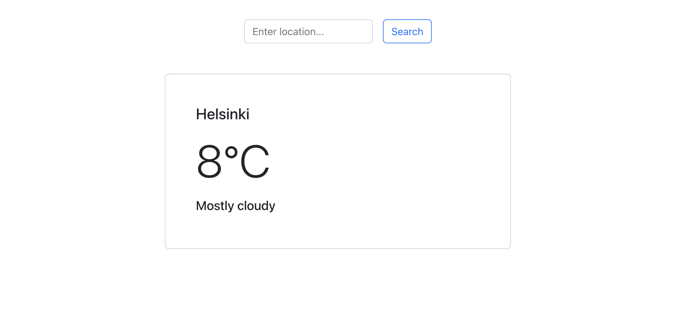

# Weather App 
A React App that uses AccuWeather API for displaying the weather around the world. 

# Running localy

Firstly, you should create an environment variable called `REACT_APP_API_KEY` where you should store the AccuWeather API key.

Secondly, you can run this app by going to the project root directory and running:

`npm start`

The App will start running at `http://localhost:3000/`

# Deployment

The App is deploed on Netlify and can be found here:

[Weather App]()

